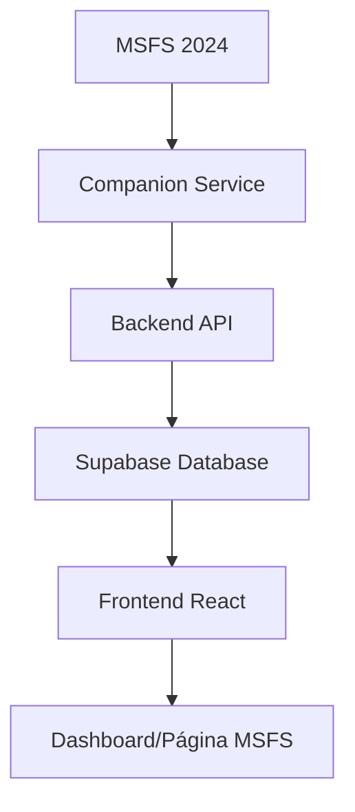

# Guia de Integração MSFS 2024

Este guia explica como configurar e usar a integração com Microsoft Flight Simulator 2024 para capturar automaticamente seus voos e exibi-los no Flight Log.

## 📋 Pré-requisitos

- Microsoft Flight Simulator 2024 instalado
- Node.js 18+ instalado
- Flight Log aplicação rodando
- SimConnect SDK (incluído com MSFS)

## 🚀 Como Funciona

A integração funciona através de 3 componentes principais:

### 1. **Companion Service** (`companion/companion-msfs.ts`)
- Conecta com MSFS via SimConnect
- Monitora telemetria em tempo real
- Detecta início/fim de voos automaticamente
- Envia dados para o backend

### 2. **Backend API** (`backend/src/routes/msfs.ts`)
- Recebe dados de voo do companion
- Resolve aeroportos ICAO por coordenadas
- Armazena no banco de dados Supabase

### 3. **Frontend React** (`src/components/dashboard/MSFSFlights.tsx`)
- Exibe histórico de voos
- Mostra estatísticas detalhadas
- Permite gerenciar voos capturados

## 🛠️ Configuração Passo a Passo

### Passo 1: Configurar Variáveis de Ambiente

1. **Backend** - Copie `.env.example` para `.env`:
```bash
cd backend
cp .env.example .env
```

2. **Companion** - Copie `.env.example` para `.env`:
```bash
cd companion
cp .env.example .env
```

3. Configure as URLs nos arquivos `.env`:
```env
# backend/.env
BACKEND_URL=http://localhost:3001

# companion/.env
BACKEND_URL=http://localhost:3001
```

### Passo 2: Instalar Dependências

```bash
# Backend
cd backend
npm install

# Companion
cd companion
npm install

# Frontend (se ainda não instalado)
npm install
```

### Passo 3: Iniciar os Serviços

**Terminal 1 - Backend:**
```bash
cd backend
npm run dev
```

**Terminal 2 - Frontend:**
```bash
npm run dev
```

**Terminal 3 - Companion (apenas quando for voar):**
```bash
cd companion
npm run dev
```

## ✈️ Como Usar

### 1. Preparação para Voo

1. **Inicie MSFS 2024**
2. **Inicie o companion service** (Terminal 3 acima)
3. **Carregue sua aeronave** no simulador
4. **Posicione-se no aeroporto** de partida

### 2. Durante o Voo

- O companion detecta automaticamente quando você:
  - **Inicia o voo** (velocidade > 30 kts)
  - **Pousa** (velocidade < 30 kts por 10+ segundos)
- Monitora continuamente:
  - Posição (lat/lon)
  - Altitude
  - Velocidade
  - Tipo de aeronave

### 3. Após o Voo

- O voo é **automaticamente salvo** no banco
- **Aeroportos ICAO** são resolvidos por proximidade
- **Estatísticas** são atualizadas em tempo real
- Dados aparecem no **dashboard** imediatamente

## 📊 Dados Capturados

Cada voo registra:

- **Aeronave**: Tipo/modelo usado
- **Rota**: ICAO partida → ICAO chegada
- **Tempo**: Duração total do voo
- **Distância**: Milhas náuticas percorridas
- **Performance**: Altitude e velocidade máximas
- **Coordenadas**: Posições de partida e chegada
- **Timestamp**: Data/hora completa

## 🎯 Funcionalidades do Frontend

### Dashboard Principal
- **Últimos 3 voos** MSFS na seção "Voos MSFS 2024"
- **Estatísticas resumidas** integradas

### Página Dedicada (`/msfs-flights`)
- **Histórico completo** de voos
- **Estatísticas detalhadas**:
  - Total de voos e tempo
  - Distância acumulada
  - Aeronave favorita
  - Rota mais voada
- **Filtros e busca**:
  - Por aeronave
  - Por período
  - Por rota
- **Ações**:
  - Exportar para CSV
  - Deletar voos individuais
  - Limpar histórico completo

## 🔧 Resolução de Problemas

### Companion não conecta com MSFS

```bash
# Verifique se MSFS está rodando
# Reinicie o companion
cd companion
npm run dev
```

### Aeroportos não são identificados

- Verifique se `airports.csv` existe em `data/`
- Confirme se o backend está processando coordenadas
- Logs aparecem no console do backend

### Voos não aparecem no frontend

1. **Verifique autenticação** - usuário logado?
2. **Confirme backend** - API respondendo?
3. **Check database** - dados sendo salvos?
4. **Refresh página** - cache do browser?

### Performance Issues

- **Companion**: Ajuste intervalo de polling em `companion-msfs.ts`
- **Frontend**: Limite de voos exibidos (padrão: 50)
- **Database**: Índices nas colunas de busca

## 📝 Logs e Debug

### Companion Logs
```bash
# Logs detalhados no terminal
[MSFS] Conectado ao simulador
[MSFS] Voo iniciado: A320 em SBGR
[MSFS] Voo finalizado: SBGR → SBSP (45 min)
```

### Backend Logs
```bash
# API endpoints
POST /api/msfs/logbook - Receber voo
GET /api/msfs/flights - Listar voos
```

### Frontend Debug
- **Console do browser** para erros React
- **Network tab** para chamadas API
- **Supabase logs** para queries database

## 🔄 Fluxo Completo



1. **MSFS** gera telemetria via SimConnect
2. **Companion** processa e detecta voos
3. **Backend** recebe, valida e resolve ICAOs
4. **Database** armazena dados estruturados
5. **Frontend** consulta e exibe informações
6. **Usuário** visualiza histórico e estatísticas

## 🎮 Dicas de Uso

- **Inicie companion** apenas quando for voar (economiza recursos)
- **Mantenha MSFS aberto** durante todo o voo
- **Evite pausar** o simulador durante voos longos
- **Use aeroportos reais** para melhor resolução ICAO
- **Voos muito curtos** (< 5 min) podem não ser detectados

## 🚀 Próximos Passos

- [ ] **WebSocket real-time** para tracking ao vivo
- [ ] **Mapas interativos** com rotas de voo
- [ ] **Análise de performance** por aeronave
- [ ] **Integração com logbooks** externos
- [ ] **Suporte a voos IFR/VFR** específicos

---

**✅ Integração completa e funcional!**

Agora você pode voar no MSFS 2024 e ter todos os seus voos automaticamente registrados no Flight Log. 🛩️