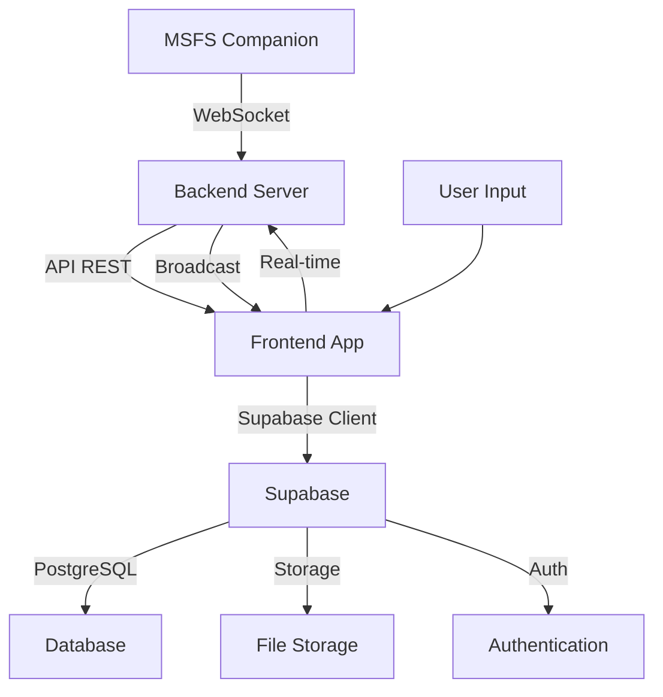
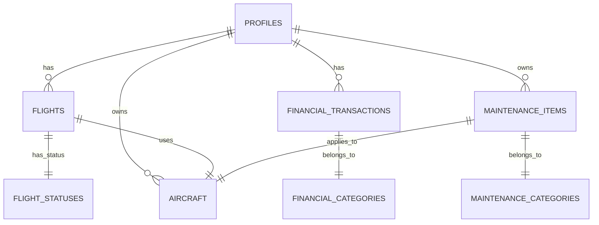

# 📋 Documentação Técnica - Flight Log Opus

> Sistema completo de gerenciamento de carreira para pilotos virtuais

## 📁 Índice

1. [Visão Geral do Projeto](#visão-geral-do-projeto)
2. [Tecnologias Utilizadas](#tecnologias-utilizadas)
3. [Arquitetura do Sistema](#arquitetura-do-sistema)
4. [Banco de Dados](#banco-de-dados)
5. [Rotas e Endpoints](#rotas-e-endpoints)
6. [Configuração e Deploy](#configuração-e-deploy)
7. [Testes](#testes)
8. [Convenções de Código](#convenções-de-código)
9. [Fluxo de Trabalho](#fluxo-de-trabalho)

---

## 1. Visão Geral do Projeto

### Objetivo Principal
Flight Log Opus é um sistema web completo para gerenciamento de carreira de pilotos virtuais, especialmente projetado para integrar com Microsoft Flight Simulator 2024. O sistema permite:

- Registro e acompanhamento de voos
- Gerenciamento financeiro (despesas e receitas)
- Sistema de classificação e ranking
- Configuração de aeronaves e companhias
- Planejamento de rotas e cálculos de performance
- Integração em tempo real com MSFS

### Público-Alvo
- Pilotos virtuais que utilizam MSFS 2024
- Comunidades de simulação de voo
- Instrutores de voo virtual
- Desenvolvedores de sistemas de logbook

### Casos de Uso Principais

1. **Registro de Voo**: Pilotos podem registrar manualmente ou automaticamente (via MSFS) seus voos
2. **Gerenciamento Financeiro**: Controle de despesas operacionais e receitas de voo
3. **Progressão de Carreira**: Sistema de níveis, ratings e ranking mundial
4. **Planejamento de Voo**: Ferramentas para cálculo de performance e planejamento de rotas
5. **Análise de Dados**: Relatórios financeiros e estatísticas de voo

---

## 2. Tecnologias Utilizadas

### Frontend

#### Linguagens e Frameworks
- **React 18.3.1**: Biblioteca principal para interface
- **TypeScript 5.6.2**: Tipagem estável para desenvolvimento seguro
- **Vite**: Build tool rápido e moderno
- **React Router 6**: Navegação entre páginas

#### UI e Estilização
- **Tailwind CSS**: Framework CSS utility-first
- **Shadcn/ui**: Componentes UI baseados em Radix UI
- **Radix UI**: Componentes acessíveis e sem estilos
- **Lucide React**: Ícones SVG

#### Gerenciamento de Estado e Dados
- **TanStack Query (React Query)**: Gerenciamento de estado assíncrono
- **React Hook Form**: Formulários com validação
- **Zod**: Validação de schemas

#### Internacionalização
- **i18next**: Sistema de internacionalização
- **react-i18next**: Integração com React

#### Outras Bibliotecas
- **React Window**: Renderização virtualizada de listas longas
- **React Virtualized**: Componentes para listas grandes
- **React Toastify**: Sistema de notificações
- **React Hook Form**: Formulários reativos

### Backend

#### Linguagens e Frameworks
- **Node.js**: Runtime JavaScript
- **Express.js**: Framework web
- **TypeScript**: Tipagem estável
- **WS**: WebSocket para comunicação em tempo real

#### Banco de Dados
- **Supabase**: Backend BaaS (PostgreSQL + Auth + Storage)
- **PostgreSQL**: Sistema de gerenciamento de banco de dados

#### Segurança e Autenticação
- **Helmet**: Segurança HTTP headers
- **CORS**: Cross-Origin Resource Sharing
- **Rate Limiting**: Controle de requisições

#### Outras Bibliotecas
- **Zod**: Validação de schemas
- **Compression**: Compressão de respostas
- **Dotenv**: Gerenciamento de variáveis de ambiente

### DevOps e Build

#### Ferramentas de Desenvolvimento
- **ESLint**: Linting de código
- **Prettier**: Formatação de código
- **Husky**: Git hooks
- **Lint-staged**: Linting de arquivos staged

#### Deploy
- **Cloudflare Pages**: Deploy frontend
- **Docker**: Containerização (para backend)
- **GitHub Actions**: CI/CD

---

## 3. Arquitetura do Sistema

### Arquitetura Frontend (FSD - Feature Sliced Design)

```
src/
├── app/           # Configuração e inicialização da aplicação
├── processes/     # Processos de negócio complexos
├── pages/         # Páginas da aplicação
├── widgets/       # Componentes complexos reutilizáveis
├── features/      # Funcionalidades independentes
├── entities/      # Modelos de dados e entidades
└── shared/        # Código compartilhado (UI, utils, types)
```

#### Estrutura de Páginas

```typescript
// Páginas principais do sistema
pages/
├── Index.tsx               # Página inicial/dashboard
├── Flights.tsx             # Registro e visualização de voos
├── Financial.tsx           # Gestão financeira
├── Profile.tsx             # Perfil do usuário
├── Maintenance.tsx         # Manutenção de aeronaves
├── Purchases.tsx           # Compras e upgrades
├── FinancialReports.tsx    # Relatórios financeiros
├── Companies.tsx           # Gestão de companhias
├── TodCalculator.tsx       # Calculadora de performance
├── FlightPlanner.tsx       # Planejamento de rotas
├── AirportSearchTool.tsx   # Busca de aeroportos
├── RealTimeTracking.tsx    # Tracking em tempo real
├── FlightMaps.tsx          # Mapas de voo
├── Ranking.tsx             # Ranking mundial
├── History.tsx             # Histórico de voos
├── Goals.tsx               # Metas de carreira
├── Settings.tsx            # Configurações do sistema
├── Login.tsx               # Autenticação
├── Signup.tsx              # Cadastro de usuários
└── AuthCallback.tsx        # Callback de autenticação
```

#### Estrutura de Features

```typescript
// Features organizadas por domínio de negócio
features/
├── flight-logging/         # Registro de voos
│   ├── components/         # Componentes de registro
│   ├── hooks/             # Lógica de negócio
│   ├── services/          # Serviços de API
│   └── types/             # Tipos TypeScript
├── financial-management/   # Gestão financeira
├── career-tracking/        # Progressão de carreira
├── maintenance-management/ # Manutenção de aeronaves
├── profile-management/     # Gestão de perfil
├── authentication/         # Autenticação e autorização
└── real-time-tracking/     # Tracking em tempo real
```

#### Estrutura de Hooks

```typescript
// Hooks organizados por camada de negócio
hooks/
├── business/               # Lógica de negócio
│   ├── useFlightDraft.ts   # Rascunho de voo
│   ├── useFlightNavigation.ts # Navegação de voo
│   ├── useFlightSettings.ts   # Configurações de voo
│   ├── useFlightStatusManager.ts # Gerenciamento de status
│   ├── useFlights.ts       # Consulta de voos
│   ├── useFinancial.ts     # Operações financeiras
│   ├── useFinancialSettings.ts # Configurações financeiras
│   ├── useExpenseCategories.ts # Categorias de despesas
│   ├── useRevenueCategories.ts # Categorias de receitas
│   ├── useMaintenanceManager.ts # Gerenciamento de manutenção
│   ├── useAircraftManager.ts   # Gestão de aeronaves
│   ├── useSupabaseAircraftManager.ts # Aeronaves no Supabase
│   ├── useSupabaseCareerManager.ts # Carreira no Supabase
│   ├── useSupabaseFinancial.ts # Finanças no Supabase
│   ├── useSupabaseFinancialReports.ts # Relatórios no Supabase
│   ├── useSupabaseFlightStatusManager.ts # Status de voo no Supabase
│   ├── useSupabaseFlights.ts # Voos no Supabase
│   ├── useSupabaseGoals.ts # Metas no Supabase
│   ├── useSupabaseMSFSFlights.ts # Voos MSFS no Supabase
│   ├── useSupabasePurchases.ts # Compras no Supabase
│   ├── useSupabaseRevenueCategories.ts # Categorias de receita no Supabase
│   ├── useSupabaseExpenseCategories.ts # Categorias de despesa no Supabase
│   ├── useSupabaseMaintenanceSettings.ts # Configurações de manutenção no Supabase
│   ├── useTheme.ts         # Gerenciamento de tema
│   └── use-toast.ts        # Sistema de notificações
├── supabase/             # Integração com Supabase
│   ├── useFlightSessions.ts # Sessões de voo
│   └── useMaintenanceSettings.ts # Configurações de manutenção
└── ui/                   # Hooks de interface
    ├── use-mobile.tsx    # Detecção de mobile
    ├── useTheme.ts       # Tema do sistema
    └── use-toast.ts      # Notificações
```

#### Estrutura de Serviços

```typescript
// Serviços de negócio organizados por domínio
services/
├── airportService.ts     # Busca e gerenciamento de aeroportos
├── flightTrackingService.ts # Tracking de voos em tempo real
├── financialService.ts   # Operações financeiras
├── careerService.ts      # Progressão de carreira
├── maintenanceService.ts # Manutenção de aeronaves
└── authService.ts        # Autenticação e autorização
```

### Arquitetura Backend (MVC)

```
backend/src/
├── controllers/           # Controladores REST
│   ├── msfsController.ts  # Controle de integração MSFS
│   └── flightController.ts # Controle de voos
├── models/               # Modelos de dados
├── middleware/           # Middlewares
│   ├── authMiddleware.ts # Autenticação
│   ├── corsMiddleware.ts # CORS
│   └── rateLimitMiddleware.ts # Limitação de requisições
├── validators/           # Validações
│   ├── flightValidator.ts # Validação de voos
│   └── msfsValidator.ts   # Validação de dados MSFS
├── config/               # Configurações
│   ├── database.ts       # Configuração do banco
│   └── supabase.ts       # Configuração do Supabase
└── utils/                # Utilitários
    ├── flightCalculations.ts # Cálculos de voo
    ├── airportService.ts   # Serviço de aeroportos
    └── telemetryProcessor.ts # Processamento de telemetria
```

### Padrões Arquiteturais

#### Frontend
- **Feature Sliced Design (FSD)**: Organização por features
- **Component Composition**: Composição de componentes
- **Custom Hooks**: Lógica reutilizável
- **Context API**: Gerenciamento de estado global
- **React Query**: Gerenciamento de estado assíncrono
- **React Window**: Renderização virtualizada

#### Backend
- **MVC (Model-View-Controller)**: Separação de responsabilidades
- **Repository Pattern**: Camada de acesso a dados
- **Service Layer**: Lógica de negócio
- **Middleware Pattern**: Tratamento de requisições
- **WebSocket Pattern**: Comunicação em tempo real
- **Event-Driven Architecture**: Eventos de voo e telemetria

### Fluxo de Dados Principal



---

## 4. Banco de Dados

### Sistema de Gerenciamento
- **Supabase**: Plataforma BaaS completa
- **PostgreSQL**: Banco de dados relacional
- **Realtime**: WebSockets para atualizações em tempo real
- **Storage**: Armazenamento de arquivos
- **Auth**: Sistema de autenticação

### Modelo de Dados Principal

#### Tabela: profiles

```sql
CREATE TABLE profiles (
    id UUID PRIMARY KEY,
    display_name TEXT DEFAULT 'Cmdte. Rodrigo',
    email TEXT,
    avatar_url TEXT,
    total_flights INTEGER DEFAULT 0,
    total_minutes INTEGER DEFAULT 0,
    career_rating INTEGER DEFAULT 0,
    total_rating INTEGER DEFAULT 0,
    career_level INTEGER DEFAULT 1,
    career_class TEXT DEFAULT 'D',
    world_ranking INTEGER DEFAULT 0,
    initial_flights INTEGER DEFAULT 0,
    initial_hours NUMERIC(10, 2) DEFAULT 0,
    created_at TIMESTAMP WITH TIME ZONE DEFAULT now(),
    updated_at TIMESTAMP WITH TIME ZONE DEFAULT now()
);
```

#### Tabela: flights

```sql
CREATE TABLE flights (
    id UUID PRIMARY KEY DEFAULT uuid_generate_v4(),
    user_id UUID NOT NULL REFERENCES profiles(id),
    callsign TEXT NOT NULL,
    aircraft TEXT NOT NULL,
    departure TEXT NOT NULL,
    arrival TEXT NOT NULL,
    departure_time TEXT,
    arrival_time TEXT,
    flight_time TEXT,
    distance NUMERIC DEFAULT 0,
    fuel_used NUMERIC DEFAULT 0,
    landing_rate NUMERIC DEFAULT 0,
    experience_points INTEGER DEFAULT 0,
    career_rating INTEGER DEFAULT 0,
    status TEXT DEFAULT 'completed',
    flight_date TEXT NOT NULL,
    route TEXT,
    notes TEXT,
    is_example BOOLEAN DEFAULT false,
    service_type TEXT,
    origin_country TEXT,
    destination_country TEXT,
    origin_airport_info JSONB,
    destination_airport_info JSONB,
    created_at TIMESTAMP WITH TIME ZONE DEFAULT now(),
    updated_at TIMESTAMP WITH TIME ZONE DEFAULT now()
);
```

#### Tabela: financial_transactions

```sql
CREATE TABLE financial_transactions (
    id UUID PRIMARY KEY DEFAULT uuid_generate_v4(),
    user_id UUID NOT NULL REFERENCES profiles(id),
    type TEXT NOT NULL CHECK (type IN ('expense', 'revenue')), -- Tipo: despesa ou receita
    category_id UUID NOT NULL REFERENCES financial_categories(id),
    amount NUMERIC(10, 2) NOT NULL,
    description TEXT,
    date TEXT NOT NULL, -- Formato: YYYY-MM-DD
    created_at TIMESTAMP WITH TIME ZONE DEFAULT now(),
    updated_at TIMESTAMP WITH TIME ZONE DEFAULT now()
);
```

### Principais Relacionamentos



### Estratégias de Migração

#### Sistema de Migrações
- **Scripts SQL**: Migrações manuais via SQL scripts
- **Supabase Migrations**: Sistema de migrações automático
- **Rollback**: Scripts de reversão disponíveis

#### Principais Migrações

1. **01_recreate_profiles_table.sql**: Recriação da tabela de perfis
2. **02_recreate_flights_table.sql**: Recriação da tabela de voos
3. **03_recreate_expense_categories_table.sql**: Categorias de despesas
4. **04_recreate_revenue_categories_table.sql**: Categorias de receitas
5. **05_recreate_flight_statuses_table.sql**: Status de voos
6. **06_recreate_custom_aircraft_table.sql**: Aeronaves personalizadas
7. **07_recreate_goals_table.sql**: Metas de carreira
8. **08_recreate_financial_views_and_functions.sql**: Views e funções financeiras

---

## 5. Rotas e Endpoints

### Frontend Routes

```typescript
// Rotas principais
const routes = [
    { path: '/', component: Index },
    { path: '/flights', component: Flights },
    { path: '/financial', component: Financial },
    { path: '/maintenance', component: Maintenance },
    { path: '/profile', component: Profile },
    { path: '/settings', component: Settings },
    { path: '/login', component: LoginPage },
    { path: '/signup', component: SignupPage },
    { path: '/real-time-tracking', component: RealTimeTracking },
    { path: '/flight-maps', component: FlightMaps },
    { path: '/purchases', component: Purchases },
    { path: '/financial-reports', component: FinancialReports },
    { path: '/companies', component: Companies },
    { path: '/tod-calculator', component: TodCalculatorPage },
    { path: '/flight-planner', component: FlightPlannerPage },
    { path: '/airport-search', component: AirportSearchTool },
    { path: '/auth/callback', component: AuthCallback },
    { path: '/email-confirmation', component: EmailConfirmationPage },
    { path: '/diagnostic', component: Diagnostic },
    { path: '/super-diagnostic', component: SuperDiagnostic },
    { path: '*', component: NotFound }
];
```

### Backend API Endpoints

#### MSFS Integration

```typescript
// POST /api/msfs/logbook
// Recebe dados de voo do MSFS Companion
app.post('/api/msfs/logbook', async (req, res) => {
    const flightData = FlightDataSchema.parse(req.body);
    // Processamento e armazenamento
});

// POST /api/msfs/telemetry
// Recebe telemetria em tempo real
app.post('/api/msfs/telemetry', async (req, res) => {
    const telemetry = TelemetrySchema.parse(req.body);
    // Broadcast para clientes WebSocket
});

// GET /api/msfs/flights
// Lista voos MSFS
app.get('/api/msfs/flights', async (req, res) => {
    // Consulta ao banco de dados
});
```

#### Flight Management

```typescript
// GET /api/flights
// Lista todos os voos do usuário
// Parâmetros: limit, offset, date_from, date_to

// POST /api/flights
// Cria um novo voo
// Body: { callsign, aircraft, departure, arrival, ... }

// PUT /api/flights/:id
// Atualiza um voo existente

// DELETE /api/flights/:id
// Remove um voo

// GET /api/flights/stats
// Estatísticas de voo do usuário
```

#### Financial Management

```typescript
// GET /api/financial/transactions
// Lista transações financeiras
// Parâmetros: type, category, date_from, date_to

// POST /api/financial/transactions
// Cria nova transação
// Body: { type, category_id, amount, description, date }

// GET /api/financial/reports
// Relatórios financeiros
// Parâmetros: period, type

// GET /api/financial/categories
// Lista categorias financeiras
```

#### Profile Management

```typescript
// GET /api/profile
// Obtém perfil do usuário

// PUT /api/profile
// Atualiza perfil do usuário
// Body: { display_name, email, avatar_url }

// GET /api/profile/stats
// Estatísticas do perfil
```

#### Aircraft Management

```typescript
// GET /api/aircraft
// Lista aeronaves do usuário

// POST /api/aircraft
// Cria nova aeronave
// Body: { name, type, registration, ... }

// PUT /api/aircraft/:id
// Atualiza aeronave

// DELETE /api/aircraft/:id
// Remove aeronave
```

### Exemplos de Requisições

#### Registro de Voo

```http
POST /api/flights
Content-Type: application/json
Authorization: Bearer <token>

{
    "callsign": "OPUS001",
    "aircraft": "Cessna 172",
    "departure": "SBSP",
    "arrival": "SBGR",
    "departure_time": "2024-01-15T10:30:00Z",
    "arrival_time": "2024-01-15T11:45:00Z",
    "flight_time": "1:15",
    "distance": 120.5,
    "fuel_used": 15.2,
    "landing_rate": -120,
    "flight_date": "2024-01-15"
}
```

#### Resposta de Estatísticas

```http
GET /api/profile/stats
Authorization: Bearer <token>

{
    "total_flights": 150,
    "total_hours": 245,
    "total_minutes": 14700,
    "career_rating": 85,
    "career_level": 5,
    "career_class": "A",
    "world_ranking": 1250,
    "recent_flights": [
        {
            "id": "uuid",
            "callsign": "OPUS001",
            "aircraft": "Cessna 172",
            "departure": "SBSP",
            "arrival": "SBGR",
            "flight_time": "1:15",
            "date": "2024-01-15"
        }
    ]
}
```

---

## 6. Configuração e Deploy

### Requisitos do Sistema

#### Frontend
- Node.js 22.16.0+
- npm 10.9.2+
- Navegador moderno (Chrome 90+, Firefox 88+, Safari 14+)

#### Backend
- Node.js 22.16.0+
- npm 10.9.2+
- Portas disponíveis: 3001 (API), 3003 (WebSocket)

#### Banco de Dados
- Acesso ao Supabase project
- PostgreSQL 13+

### Configuração do Ambiente

#### Variáveis de Ambiente Frontend

```bash
# .env.development
VITE_SUPABASE_URL=https://your-project.supabase.co
VITE_SUPABASE_ANON_KEY=your-anon-key
VITE_API_BASE_URL=http://localhost:3001
VITE_WS_URL=ws://localhost:3003
```

#### Variáveis de Ambiente Backend

```bash
# .env
PORT=3001
WS_PORT=3003
NODE_ENV=development

# Supabase
SUPABASE_URL=https://your-project.supabase.co
SUPABASE_ANON_KEY=your-anon-key
SUPABASE_SERVICE_ROLE_KEY=your-service-key

# MSFS Integration
MSFS_ENABLED=true
MSFS_PORT=3002
```

### Processo de Build

#### Frontend

```bash
# Instalar dependências
npm install

# Build para produção
npm run build

# Preview de produção
npm run preview
```

#### Backend

```bash
# Instalar dependências
npm install

# Build para produção
npm run build

# Iniciar servidor
npm start
```

### Deploy

#### Frontend no Cloudflare Pages

1. Conectar repositório ao Cloudflare Pages
2. Configurar build command: `npm run build`
3. Configurar build output directory: `dist`
4. Definir variáveis de ambiente

#### Backend

**Opção 1: Docker**

```dockerfile
FROM node:22-alpine
WORKDIR /app
COPY package*.json ./
RUN npm install
COPY . .
RUN npm run build
EXPOSE 3001
CMD ["npm", "start"]
```

**Opção 2: Vercel/Render**

1. Conectar repositório
2. Configurar variáveis de ambiente
3. Definir comando de build e start

---

## 7. Testes

### Estratégia de Testes

#### Testes Unitários
- **Jest**: Framework de testes
- **React Testing Library**: Testes de componentes
- **MSW**: Mock de APIs

#### Testes de Integração
- **Supabase Testing**: Testes com banco de dados real
- **API Testing**: Testes de endpoints REST

#### Testes de Interface
- **Cypress**: Testes E2E
- **Playwright**: Testes de navegador

### Como Executar os Testes

#### Testes Unitários

```bash
# Rodar todos os testes
npm test

# Rodar testes em modo watch
npm run test:watch

# Gerar cobertura de testes
npm run test:coverage
```

#### Testes de Integração

```bash
# Testes de API
npm run test:integration

# Testes de banco de dados
npm run test:database
```

#### Testes E2E

```bash
# Cypress
npm run cypress:open

# Playwright
npm run test:e2e
```

### Estrutura de Testes

```typescript
// Exemplo de teste unitário
import { render, screen } from '@testing-library/react';
import FlightCard from '../components/FlightCard';

describe('FlightCard', () => {
    it('should render flight information', () => {
        render(<FlightCard flight={mockFlight} />);
        expect(screen.getByText('OPUS001')).toBeInTheDocument();
    });
});
```

---

## 8. Convenções de Código

### JavaScript/TypeScript

#### Formatação
- **Prettier**: Configuração padrão
- **Indentação**: 2 espaços
- **Aspas**: Simples para strings
- **Semi-colons**: Obrigatórios

#### Naming Conventions

```typescript
// Components: PascalCase
const FlightCard = () => {};

// Functions: camelCase
const calculateFlightTime = () => {};

// Variables: camelCase
const flightData = {};

// Constants: UPPER_SNAKE_CASE
const MAX_FLIGHT_TIME = 24;

// Types: PascalCase
interface FlightData {}

// Files: kebab-case
flight-card.tsx
```

#### TypeScript Guidelines

```typescript
// Interfaces para props
interface FlightCardProps {
    flight: Flight;
    onEdit?: (flight: Flight) => void;
}

// Types para enums
type FlightStatus = 'completed' | 'in_progress' | 'cancelled';

// Generics para reutilização
interface ApiResponse<T> {
    data: T;
    success: boolean;
}
```

### CSS/SCSS

#### Tailwind CSS
- **Utility-first**: Classes do Tailwind
- **Componentes**: Extrair para classes quando necessário
- **Responsividade**: Mobile-first approach

#### Naming
- **BEM**: Para classes customizadas
- **Semântico**: Nomes descritivos

### Git

#### Conventional Commits

```bash
feat: add flight tracking integration
fix: resolve airport search bug
docs: update API documentation
style: format code with prettier
refactor: simplify flight calculation logic
```

#### Branch Naming

```bash
feature/flight-tracking
fix/airport-search
docs/api-documentation
chore/dependencies-update
```

---

## 9. Fluxo de Trabalho

### Desenvolvimento

1. **Criar branch**: `git checkout -b feature/nome-da-feature`
2. **Desenvolver**: Implementar funcionalidade
3. **Testar**: Executar testes locais
4. **Commit**: Mensagem seguindo conventional commits
5. **Push**: `git push origin feature/nome-da-feature`
6. **Pull Request**: Criar PR no GitHub

### Code Review

- **Revisores**: Mínimo 1 revisor
- **Checklist**: Testes, documentação, convenções
- **Aprovação**: Necessária antes do merge

### Deploy

#### Desenvolvimento
- **Branch**: `develop`
- **Deploy**: Automático no Cloudflare Pages
- **Ambiente**: `dev.flight-log-opus.pages.dev`

#### Produção
- **Branch**: `main`
- **Deploy**: Manual após aprovação
- **Ambiente**: `flight-log-opus.pages.dev`

### Monitoramento

#### Frontend
- **Error Tracking**: Sentry
- **Performance**: Lighthouse CI
- **Analytics**: Google Analytics

#### Backend
- **Logging**: Winston
- **Monitoring**: Health checks
- **Alerts**: Supabase alerts

---

## 📞 Suporte

Para suporte técnico ou dúvidas sobre o projeto:

- **Issues**: [GitHub Issues](https://github.com/username/flight-log-opus/issues)
- **Discord**: Comunidade de desenvolvedores
- **Email**: contato@flightlogopus.com

---

> **Nota**: Esta documentação está em constante atualização. Consulte o repositório para versões mais recentes.